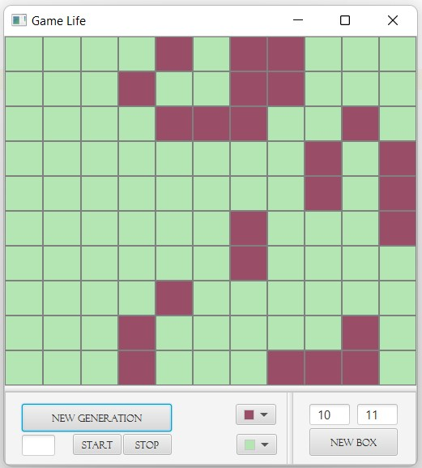
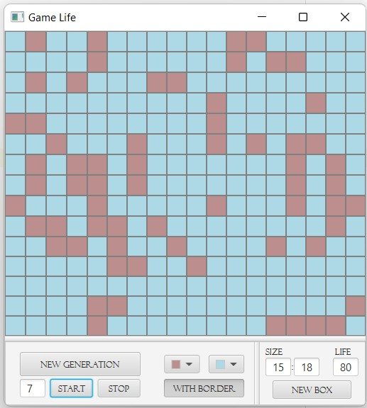

# game-Life
3d course, IntelliJ IDEA Project with MVC architecture 

`Game_Life` - basic algorithms and classes of the game (console version) + set of tests for the app

`Game_Life_FX` - GUI based on pack from Game_Life

`Game_Life_FX_client`, `Game_Life_server` - client\server GUI version of app based on pack from Game_Life

### About the game
This game is the model of cellular automaton. There is a field shared on cells, each cell has the life or is empty. 
The configuration of live cells at the moment is called the population. One step to next population executes with these rules:
- the new life appears in the empty cell if there is exactly three live cells among 8 neighbors
- the live cell continues to live if there is exactly two or three live cells among 8 neighbors
- the live cell dies if there is another num of live cells among 8 neighbors 

## How to run gui version
1. Load `Game_Life` and `Game_Life_FX` in the same repository
2. Run `Game_Life_FX` as IntelliJ IDEA Project

## How to run client\server gui version
1. Load `Game_Life`, `Game_Life_FX_client`, `Game_Life_server` in the same repository
2. Run `Game_Life_server` as IntelliJ IDEA Project
3. Run `Game_Life_FX_client` as IntelliJ IDEA Project

## About the app
### Game_Life_FX
At first you need to write sizes of bow and make new box. By ones new generation shows with special button, 
to automize it choose the num of generation and start counter.

It's possible to change color of cells.

### Game_Life_FX_client
The same functional + options to play without borders and choose the num of live cells for new box.

#### Bugs
Yeah, client\server version has a lot of defects

## Screenshots

